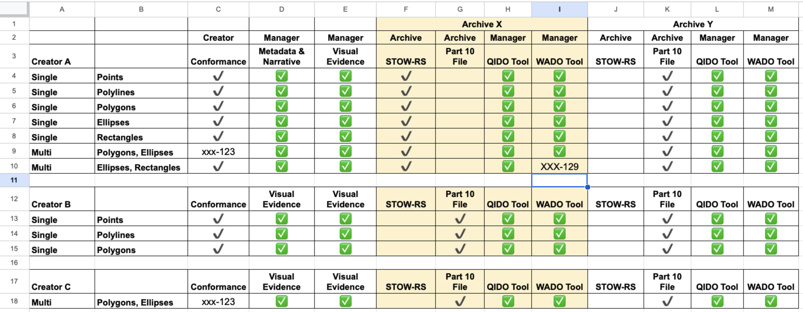
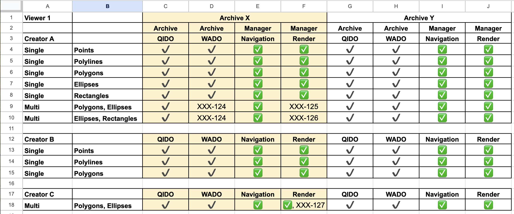
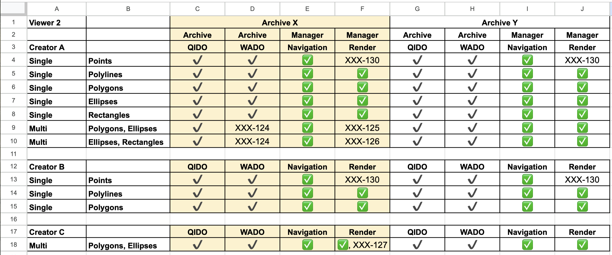

# Reporting

## Project Manager Worksheets

The Project Manager needs to maintain a record of results to serve as both a worklist of tasks to complete and as documentation for publishing finals results. The file [Project Manager Worksheets](./Project_Manager_Worksheets.xlsx) is a draft of what the Project Manager will likely use. Without describing the exact criteria for determining results, the notes below will guide interpretation.

### Creators Sheet

1. One sheet is created to record results for all Annotation Creators in the Connectathon.
2. Cells A3, A12 and A17 show how we identify the Annotation Creators. These could be real names or pseudonyms.
3. Rows 4-10 show that Creator A creates Annotation instances of different types when categorized by the geographic objects in the object. Row 4 indicates that one object will contain only Points. Row 9 indicates a different object that will contain Polygons and Ellipses (only). We could as easily label these as Creator A-Sample 1, etc. Rows 13-16 show that Creator B provides fewer examples. Row 18 shows that Creator C provides a single object.
4. Column C records that the objects submitted by the Creator passed testing with a conformance tool. The checkmark style and the fact that column C2 contains "Creator" means that the Annotation Creator is responsible for running the tool and reporting the result to the Project Manager. Cells D9 and D18 have an XXX-nnn value. These indicate the samples did not pass the conformance test and link to an item in a defect tracker. (We will likely use GitHub for the defect tracker.)
5. Columns D and E refer to items that are provided by the Creator to the Project Manager to be shared with other participants. These include Metadata and Narrative information (Column D) and Visual Evidence such as screen captures of rendered annotations (Column E). The green check marks indicate the Project Manager is resonsible for evaluating this material.
6. Columns F-I are in the context of one archive (Archive X).
   - Column F indicates the objects were placed in the archive using STOW-RS. The Archive system will attest to this.
   - Column G indicates the objects were placed in the archive using a Part 10 file upload. We prefer that participants use STOW-RS and would report only that column when appropriate.
   - Columns H and I are reported by the Project Manager who will use software tools to test the Archive as it responds to QIDO and WADO requets in the context of the various objects submitted by Creators. NB: Not clear if we will need to fill in every row in these columns. For the QIDO column, we might only need to fill in one row. We need to write the test criteria.
   - The XXX-129 is an example of a failure testing a WADO retrieve. In this hypothetical case, we imagine that the object created for row 10 was too large for the Archive to return.
7. Columns J-M are in the context of Archive Y.
8. Interpretation of upload results: Columns F, G, J, K
   - Archive X has checkmarks in both F and G. This indicates it supports the preferred STOW-RS method and can accept Part 10 files as a secondary plan.
   - Archive Y has no checkmarks in column J but does indicate success in column K. This implies it does not yet support STOW-RS. The fact that Creator A was able to test STOW-RS with Archive X indicates that the issue is thar Archive Y is likely not ready. Some detailed review is probably needed.

### Viewer 1 Sheet

1. We will create one sheet for each viewer application that registers for testing. These sheets are similar to the single sheet for all Annotation Creators. Each Viewer sheet is intended to show the status of testing that one Viewer in the context of all Annotatation Creator / Archive combinations.
2. Columns A and B show the types of Annotations created by A, B and C
   -  A4 - B10 show the seven types created by Creator A
   - A13 - B15 show the three types created by Creator B
   - A18 - B18 shows the one type created by Creator C
3. Columns D-F are in the context of one archive (Archive X).
   - Column C indicates testing status where Viewer 1 sends QIDO-RS requests to Archive X. Cell C2 (Archive) indicates that the Archive system is responsible for reporting QIDO-RS results.
   - Column D indicates testing status where Viewer 1 sends WADO-RS requests to Archive X. The Archive system is reponsible for reporting these results.
      - Cells D9 and D10 are references to an error tracking system and indicate that there was some error in this testing configuration.
   - Columns E and F are Navigation and Rendering tests that are evaluated by the Project Manager who will host a session with the Viewer and work through the combinations. This might include subject matter experts as well. The details of the Navigation and Rendering tests need to be documented.
      - Cells F9 and F10 are references to an error tracking system and indicate that there was some error in this testing configuration.
      - Cell F18 contains both a checkmark and a reference to the error tracking system. That means that the manager determined that this testing was successful but there was some warning or other notes that were recorded.
4. Columns G-J are in the context of the second archive (Archive Y). These results can be interpreted as you interpret C-F
   - Columns G-H require reporting by the Archive system (Archive Y).
   - Columns I-J are directly reported by the manager with help from a subject matter expert as needed.

### Viewer 2 Sheet

1. The Viewer 2 sheet is similar to that for Viewer 1. The row/column labels are the same as in Viewer 1 because the combinations of geometric types and archives does not depend on the Viewer.
2. Note cells with XXX-130. These are in the rows where the geometric type is Points (rows 4 and 13) and in the two Render test columns (F, J). Because these apply across both archives and are not in the Viewer 1 sheet, we would conclude there must be something that is inherent to Viewer 2. The reporting detals (XXX-130) should provide more detail.

### User 1 Sheet

1. The User 1 sheet is for a system that uses Annotation objects but does not render them. The format is the same as that used for the Viewer sheets with some exceptions.
2. Columns E and F and I and J refer to Function 1 and Function 2. These are functions that are defined by the application creator and not by the testing program. We will have to determine these on a case by case basis and determine what kind of evidence is required to determine if Function 1 and/or Function 2 are successful.
3. The example for User 1 had two functions (1 and 2). There can be other User sheets where there is a single function or more than two functions. That is determined by the application and not defined by the testing program.

## Participant Worksheets

## Publication Worksheets